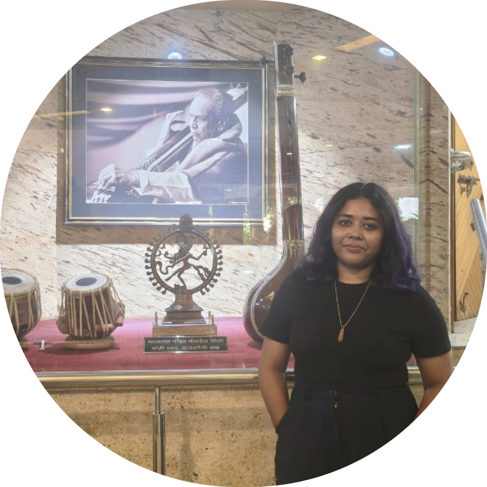

<h1> Team </h1>
 

  <a href="https://www.linkedin.com/in/anila-sebastian-1055b6130/" target="_blank"> 
  

    
    <h3 style="font-size: 15px">Dr. Anila Sebastian</h3>
    
Program Initiator, Administrator

  

  </a>
  <a href="https://www.linkedin.com/in/arindam-das-02a882191/">
  

    
    <h3  style="font-size: 15px">Arindam Das</h3>
    
Program Initiator & Administrator

  

  </a>
  <a href="https://www.linkedin.com/in/aswin-sagar-18756b242/">
  

    
    <h3  style="font-size: 15px">Dr. Aswin Sagar</h3>
    
Program Initiator & Administrator

  

  </a>
  <a href="https://srituparna.github.io/"> 
  

    
    <h3  style="font-size: 15px">Dr. Rituparna Sarkar</h3>
    
Program Initiator, Administrator & Co-ordinator

  

  </a>

 

<h2>Collaborator</h2>
 

  

    

      

        

          
        

      

      

        <h3  style="font-size: 15px"><a href="https://nabanitaborah.wixsite.com/bohemian" target="_blank"> Dr. Nabanita Borah </a></h3>
        
Mentor

        <h3  style="font-size: 15px"> <a href="https://www.linkedin.com/in/bidyut-bikash-goswami" target="_blank"> Dr. Bidyut Bikash Goswami </a> </h3>
      

    

  

 

### [back](./)
